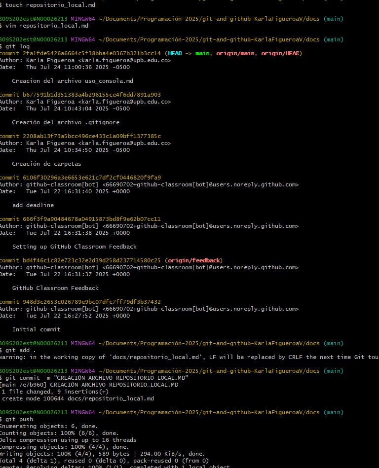

# PASOS PARA LA CREACIÓN DE UN REPOSITORIO LOCAL 

* Abro la terminal o Git Bash.
* Creo una carpeta para mi proyecto.
* Entro en la carpeta del proyecto.
* Inicializo el repositorio con Git.
* Agrego los archivos al área de preparación.
* Hago el primer commit.

