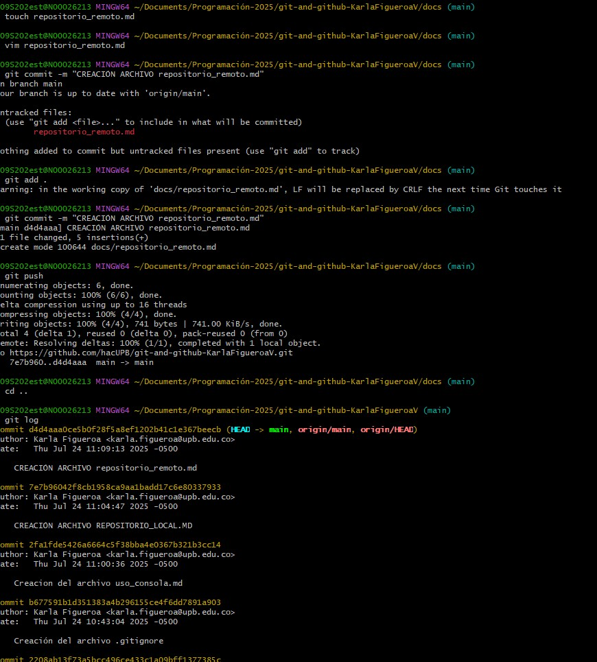

# PROCESO CRECAIÓN REPOSITORIO REMOTO

Primero, creo un repositorio en GitHub sin inicializarlo con README. Luego, copio la URL del repositorio. En mi terminal, entro a la carpeta de mi proyecto local y conecto el repositorio remoto con el comando git remote add origin URL_DEL_REPOSITORIO. Verifico que se haya agregado correctamente con git remote -v. Después, subo mis archivos con git push. Finalmente, recargo la página de GitHub y veo mis archivos.

