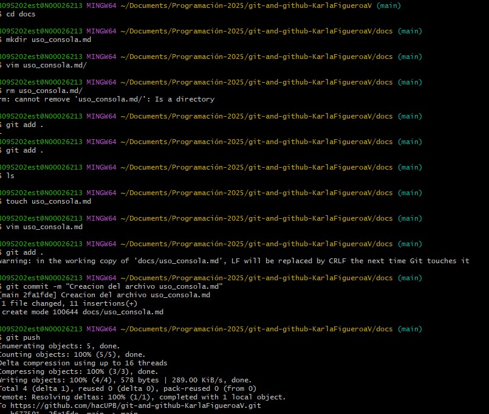

# CONCEPTOS APRENDIDOS 

- Aprendimos a movernos entre carpetas utilizando comandos como **cd**, y a ver el contenido con **ls**.

- Se utilizaron comandos como **mkdir** para crear carpetas y **touch** para crear archivos vacíos.

- Usamos **ls y **pwd** para verificar en qué directorio estamos y qué archivos contiene.

- Se introdujeron comandos como **rm** para eliminar archivos y rmdir para eliminar carpetas vacías.

